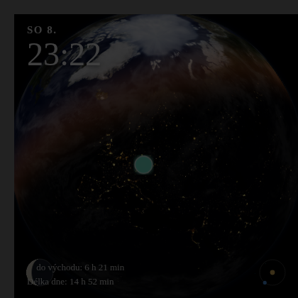

# Astronomical Globe Card

[](https://hacs.xyz)

Realistický 3D glóbus Země pro Home Assistant Lovelace, inspirovaný ciferníkem
**Astronomie** na Apple Watch – reálné NASA/Solar System Scope textury,
fyzikálně korektní den/noc terminátor počítaný z aktuální polohy Slunce,
atmosférická záře, mraky a Měsíc jako samostatné těleso se skutečnou fází
a polohou.

Žádný build krok – čisté ES moduly, three.js je vendorováno lokálně v
`dist/lib/`.



## Instalace

### HACS (doporučeno)

1. HACS → ⋮ (vpravo nahoře) → **Custom repositories**.
2. URL: `https://github.com/<tvůj-github-účet>/astronomical-globe-card`,
   kategorie **Dashboard** (plugin).
3. Najdi **Astronomical Globe Card** v HACS a klikni **Download**.
4. HA by měl resource přidat automaticky. Pokud ne: **Nastavení →
   Dashboardy → ⋮ → Resources** → přidat
   `/hacsfiles/astronomical-globe-card/astronomical-globe-card.js`
   jako **JavaScript Module**.
5. Obnov prohlížeč (Ctrl+Shift+R).

### Manuální instalace

1. Zkopíruj obsah složky `dist/` do `<config>/www/astronomical-globe-card/`:

   ```
   <config>/www/astronomical-globe-card/
       astronomical-globe-card.js
       lib/
       assets/
   ```

2. **Nastavení → Dashboardy → ⋮ → Resources** → přidej
   `/local/astronomical-globe-card/astronomical-globe-card.js` jako
   **JavaScript Module**.
3. Obnov prohlížeč.

### Přidání karty

```yaml
type: custom:astronomical-globe-card
```

Nebo přes UI editor dashboardu vyhledej **Astronomical Globe Card** a
nastav vše graficky (zdroj polohy, kvalita textur, přepínače).

## Konfigurace (YAML)

```yaml
type: custom:astronomical-globe-card
title: ""                     # volitelný titulek nad kartou
location_source: home         # 'home' (HA domovská poloha) | 'entity'
entity: person.michael        # nutné jen pokud location_source: entity
quality: medium                # 'low' | 'medium' | 'high'
show_clouds: true
show_moon: true
show_sun_marker: true
show_stars: true              # hvězdné pozadí za glóbem
show_countdown: true          # "do východu/západu: X h Y min"
show_day_length: true         # "Délka dne: X h Y min"
rotation_wobble: true         # jemná živá animace kamery kolem tvé polohy
brightness: 1.35              # 0.5-5, zesiluje hlavně světla měst (viz editor)
accent_color: ""              # volitelná CSS barva
```

### Zdroj polohy

- `location_source: home` — použije `hass.config.latitude/longitude`
  (Nastavení → Systém → Obecné). Funguje vždy, bez závislosti na entitě.
- `location_source: entity` + `entity: person.xxx` (nebo `device_tracker.*`,
  `zone.*`) — glóbus sleduje reálnou polohu dané entity. Entita musí mít
  atributy `latitude`/`longitude` (person, device_tracker a zone je mají
  standardně).

### Kvalita textur

| Kvalita | Rozlišení Země | Velikost (den+noc+mraky+Měsíc) |
|---------|----------------|----------------------------------|
| low     | 1024×512       | ~300 KB (nejrychlejší, slabší tablety) |
| medium  | 2048×1024      | ~1,2 MB (doporučeno) |
| high    | 4096×2048      | ~3 MB (nejlepší vzhled, náročnější na GPU) |

Kvalitu lze změnit kdykoli přes vizuální editor karty i za běhu.

## Responzivita a velikost karty

Karta se automaticky přizpůsobí prostoru, který jí dashboard dá – žádná
ruční konfigurace poměru stran není potřeba:

- **Sections (grid) dashboard** – buňka mřížky má pevnou šířku i výšku,
  karta ji přesně vyplní (i když není čtvercová – kamera si poměr stran
  přepočítá, takže glóbus zůstává kulatý, ne zploštělý). Karta nabízí
  výchozí velikost 6×6 přes `getGridOptions()`, jde ji ale libovolně
  přetáhnout v editoru sekce.
- **Panel view** (jedna karta na celou obrazovku) – karta se natáhne na
  celou dostupnou výšku panelu.
- **Klasický Masonry view** – sloupec dashboardu určuje jen šířku, výška
  není daná, takže karta spadne zpátky na poměr stran 1:1 odvozený ze
  šířky sloupce (stejné chování jako dřív).

## Jak to funguje

- **Terminátor** se počítá z reálné subsolární polohy (deklinace + rovnice
  času, nízko-přesné USNO/NOAA vzorce) a vykresluje se přímo ve fragment
  shaderu jako plynulý přechod den/noc textury s teplou soumrakovou září.
- **Měsíc** má skutečnou polohu (zjednodušená Meeusova nízko-přesná řada,
  přesnost řádově desítky obloukových minut) a jeho fáze vzniká přirozeně
  fyzikálním osvětlením 3D koule stejným směrem slunečního světla – žádná
  "podvržená" textura fáze.
- **Kamera** je uzamčená na tvé aktuální/domovské poloze (červená vlaječka
  je proto vždy viditelná, podobně jako na Apple Watch), s jemnou pomalou animací
  (`rotation_wobble`) pro živý dojem, aniž by to ovlivnilo přesnost
  terminátoru.
- Karta vlastní `getConfigElement()`/`getStubConfig()`, takže funguje
  s vizuálním editorem dashboardu, a při odpojení z DOM korektně uvolňuje
  three.js zdroje (žádné memory leaky při přepínání pohledů).

## Zdroje a licence

- **Kód karty** (`dist/astronomical-globe-card.js`, `dist/lib/astro.js`,
  `dist/lib/earth-shaders.js`): MIT, viz [LICENSE](LICENSE).
- **Denní textura Země, Měsíc, mraky, hvězdné pozadí**: [Solar System Scope](https://www.solarsystemscope.com/textures/)
  (CC BY 4.0 – „Solar System Scope“).
- **Noční textura Země**: [NASA Black Marble 2016](https://svs.gsfc.nasa.gov/30876/)
  (NASA Scientific Visualization Studio, veřejná doména), data VIIRS/Suomi NPP.
- **three.js**: MIT licence, vendorováno lokálně v
  `dist/lib/three.module.min.js` (v0.160.0), žádná závislost na CDN za běhu.
- Astronomické výpočty (`dist/lib/astro.js`) jsou vlastní implementace
  standardních veřejně publikovaných nízko-přesných algoritmů (NOAA Solar
  Calculator, Meeus – *Astronomical Algorithms*).

## Možná budoucí vylepšení

- Normálová/specular mapa oceánu pro ostřejší specular highlight.
- Volitelné hvězdné pozadí.
- Alternativní "volný" režim kamery (tažení myší / prstem).
